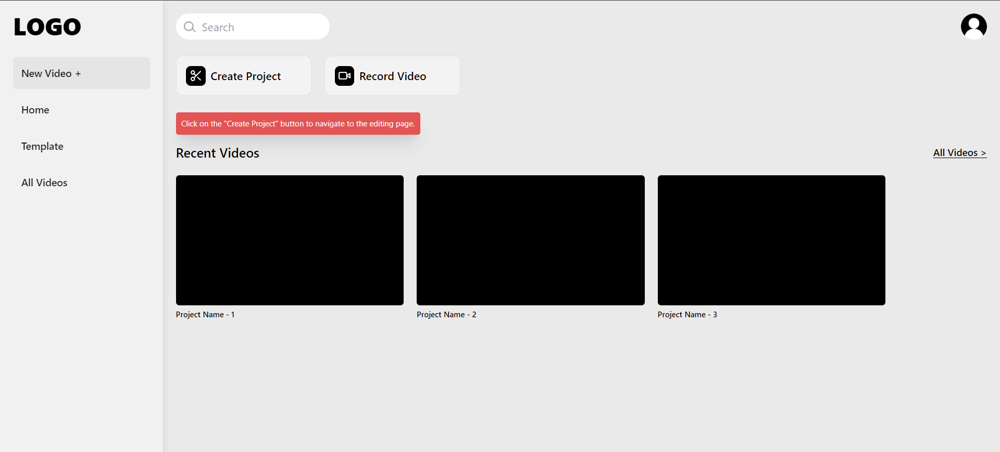
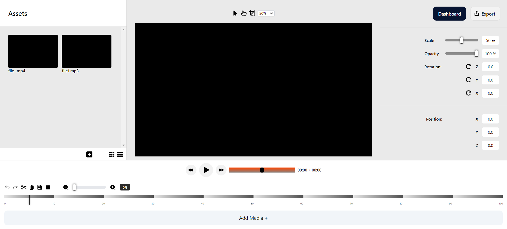

This assignment contains the UI of the dashboard and the editor page.

## Screen Previews

<blockquote><b><i>dashboard</i></b></blockquote>



<blockquote><b><i>video editor(workspace)</i></b></blockquote>



This project is live on - [https://frontend-assignment-parampragyan.vercel.app/](https://frontend-assignment-parampragyan.vercel.app/)


> <i> The extracted data like the projects and Assets are blank data shown for the demo purpose, although the name of the files are mapped properly.</i>


## Technology Used:

1. **ReactJS**
2. **JavaScript**
3. **TailwindCSS**
4. **CSS**


## File Structure:

This repository contains 2 pages and furthe devided into 12 sub components. and a JSON file for executive rendering.

> <i> In this project the "json" data is directly mapped into the components. When we will use data drom the backend, it will be fetched from an API.</i>

## Getting Started

1.Clone the repository to your local machine:

```bash
git clone https://github.com/ParamPragyan/Frontend-Assignment-parampragyan.git
```

2.Navigate to the project's directory:

```bash
cd Frontend-Assignment-parampragyan
```

3.Install dependencies using

```bash
yarn
```

## Running the App

To run the app in development mode, use the following command:


```bash
yarn dev
```
## Made by

GitHub: [Param Pragyan](https://github.com/ParamPragyan)